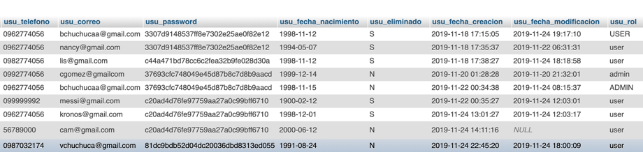

# Practica04-MiCorreoElectronico

 	FORMATO DE INFORME DE PRÁCTICA DE LABORATORIO / TALLERES / CENTROS DE SIMULACIÓN – PARA ESTUDIANTES

CARRERA:	ASIGNATURA: Programacion Hipermedial
NRO. PRÁCTICA:		TÍTULO PRÁCTICA: Resolución de problemas sobre PHP y MySQL 
OBJETIVO ALCANZADO:
•	Entender y organizar de una mejor manera los sitios de web en Internet 
•	Diseñar adecuadamente elementos gráficos en sitios web en Internet. 
•	Crear sitios web aplicando estándares actuales. 
ACTIVIDADES DESARROLLADAS
1. 1. Generar el diagrama E-R para la solución de la práctica  
  
2. Crear un repositorio en GitHub con el nombre “Practica04 – Mi Correo Electrónico”  

3. Realizar un commit y push por cada requerimiento de los puntos antes descritos. 
 
4. Luego, se debe crear el archivo README del repositorio de GitHub. 

5. El desarrollo de cada uno de los requerimientos antes descritos. 
1.	Agregar roles a la tabla usuario. Un usuario puede tener un rol de “admin” o “user”  

2.	Los usuarios con rol de “admin” pueden: modificar, eliminar y cambiar la contraseña de cualquier usuario de la base de datos.  
 
 

3.	Los usuarios con rol de “user” pueden modificar, eliminar y cambiar la contraseña de su usuario. 
 

 
4.	Visualizar en su pagina principal (index.php) el listado de todas las reuniones agendadas, ordenados por las más recientes  

5.	Crear reuniones e invitar a otros usuarios de la aplicación web. 

 
6.	Buscar en las reuniones agendadas. La búsqueda se realizará por el motivo de la 
reunión y se deberá aplicar Ajax para la búsqueda. 

 
7.	Modificar los datos del usuario 

 
8.	Cambiar la contraseña del usuario 

 
9.	Sentencias SQL de la estructura de la base de datos 
•	Cambiar contrasena
$sqlContrasena2 = "UPDATE usuario " .
 "SET usu_password = MD5($contrasena2), " .
 "usu_fecha_modificacion = '$fecha' " .
 "WHERE usu_codigo = $codigo";
•	Eliminar
$sql = "UPDATE usuario SET usu_eliminado = 'S',
 usu_fecha_modificacion = '$fecha' WHERE
usu_codigo = $codigo";
•	Modificar datos del usuario
$sql = "UPDATE usuario " .
 "SET usu_cedula = '$cedula', " .
 "usu_nombres = '$nombres', " .
 "usu_apellidos = '$apellidos', " .
 "usu_direccion = '$direccion', " .
 "usu_telefono = '$telefono', " .
 "usu_correo = '$correo', " .
 "usu_fecha_nacimiento = '$fechaNacimiento', " .
 "usu_fecha_modificacion = '$fecha', " .
  "usu_rol = '$rol' " .
 "WHERE usu_codigo = $codigo";
•	Crear usuario
$sql = "INSERT INTO usuario VALUES (0, '$cedula', '$nombres', '$apellidos', '$direccion', '$telefono','$correo', MD5('$contrasena'), '$fechaNacimiento', 'N', null, null,'user')";
•	Listar los invitados
$sql = "SELECT * FROM usuario WHERE usu_codigo=$codigo";

6.
N.

RESULTADO(S) OBTENIDO(S):
 
 
 

CONCLUSIONES: El uso de las herramientas adecuadas para desarrollo web nos ayuda a crear paginas web y agregarles funcionalidad, consultando los datos desde una base sql, php es muy importante ya que nos facilita la conexión y las consultas necesarias para el funcionamiento, Ajax nos permite implementar metodos a una pagina php sin necesidad de redirigir hacia otro enlace ya que es asincrono, manejar estas herramientas de desarrollo son de vital de importancia en la actualidad.
RECOMENDACIONES:

Estar a la vanguardia de las herramientas nuevas de desarrollo web.
Conocer y manejar distintos lenguajes para su implementacion.

Nombre de estudiante: Israel Chuchuca A.

Firma de estudiante: 

